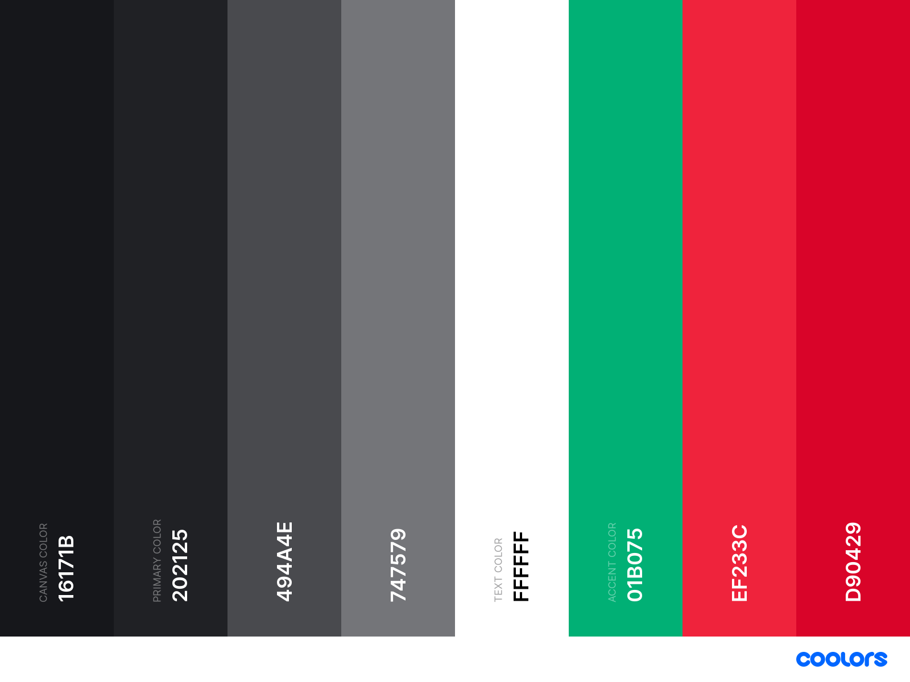
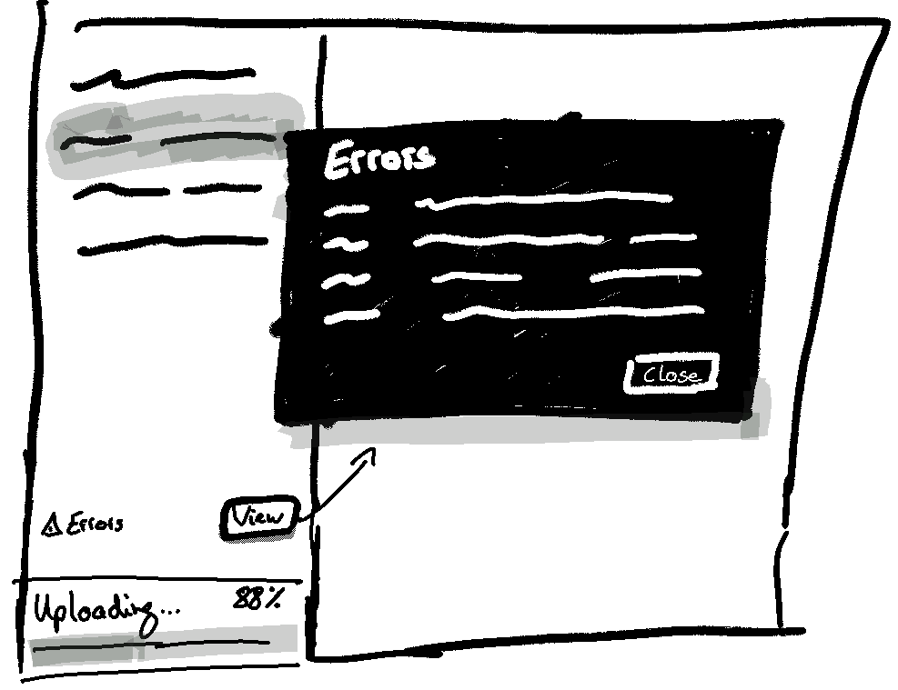

# Log Storage Client

## Getting Started

This repository contains the code for the Log Storage Client written in Dart using the framework Flutter.

For help getting started with Flutter, view the
[online documentation](https://flutter.dev/docs), which offers tutorials,
samples, guidance on mobile development, and a full API reference.

## Design

### Color Palette



### UI Design

* [Podcast Dashboard by Valery Pevnev](https://dribbble.com/shots/9699028-Podcast-Dashboard)
  
* [Desktop app - Settings by Kirill Kalita](https://dribbble.com/shots/7090778-Desktop-app-Settings)
  

* Mockup for displaying upload/download errors
   

## Development

### Flutter on Windows

1. Git

2. VSCode

3. Flutter: https://medium.com/flutter-community/flutter-for-desktop-create-and-run-a-desktop-application-ebeb1604f1e0, https://github.com/flutter/flutter/wiki/Desktop-shells

   1. Download Flutter Dev channel (Windows) [1.20.0-2.0.pre](https://storage.googleapis.com/flutter_infra/releases/dev/windows/flutter_windows_1.20.0-2.0.pre-dev.zip)
   2. Unzip, add to PATH https://flutter.dev/docs/get-started/install/windows

   ```bash
   flutter channel dev
   flutter upgrade
   flutter doctor
   # follow all instructions provided by Flutter Doctor (no need to install Android Studio though)
   cd emotion
   flutter create .
   flutter create --platforms=windows .
   flutter run
   ```

### Debugging

1. Open Visual Studio Code
2. Open any `*.dart` file
3. Hit F5 to start debugging
4. Start MinIO Server:
   * Windows:
     1. Download MinIO Server from https://min.io/download#/windows
     2. Start Minio Server:
        ```bash
        mkdir data/
         ./minio.exe server data/
         ```
     3. You can access the MinIO Browser on http://127.0.0.1:9000. The default credentials are:
        * User: `minioadmin`
        * Password: `minioadmin`
   * Docker:
     ```bash
     docker run \
         -p 9000:9000 \
         -e MINIO_ACCESS_KEY=minioadmin \
         -e MINIO_SECRET_KEY=minioadmin \
         -e MINIO_REGION_NAME=de-south-1-aalen \
         -v $(pwd)/data:/data minio/minio \
         server /data
     ```

## File Picker Workaround

Support for desktop in Flutter is still in technical preview. Therefore, some featues are not available. The project [go-flutter](https://github.com/go-flutter-desktop/go-flutter) brings support for special features such as file pickers on Linux, MacOS, and Windows

In order to compile this app, you'll need to follow [these instructions](https://github.com/miguelpruivo/flutter_file_picker/wiki/Setup#--desktop-go-flutter) (install Go + hover). Short summary:
   * Install Go
   * Install Hover: `GO111MODULE=on go get -u -a github.com/go-flutter-desktop/hover`
   * **On Windows only:** hover requires the installation of GCC. For this purpose, [install Cygwin](https://sourceware.org/cygwin/install.html). The gcc version of Cygwin somehow didn't work with Hover. Instead, I had to use [tdm-gcc](https://jmeubank.github.io/tdm-gcc/) as denoted [here on StackOverflow](https://stackoverflow.com/questions/44605108/any-ideas-how-to-solve-this-cygwin-go-build-error).
   * Excecute hover in Cygwin (on Windows) or in any shell on Linux:
      ```bash
      hover init
      hover run
      hover build windows
      ```

## MinIO

### Administration

With `mc` (MinIO Client) MinIO provides a client application for administrative purposes ([see documentation](https://docs.min.io/docs/minio-admin-complete-guide.html)).

* Run the client:
   ```bash
   docker run -it --entrypoint sh --network host minio/mc
   ```

* Add alias `test` for a MinIO Storage Service (deployed cluster):
   ```bash
   mc alias set test http://127.0.0.1:9000 minioadmin minioadmin
   mc admin info test
   ```

* List all users:
   ```bash
   mc admin user list test
   ```

* Add a new user `phil` with password `emotion`:
   ```bash
   mc admin user add test phil secretpassword
   ```

* List all policies:
   ```bash
   mc admin policy list test
   ```

* Show details of a policy:
   ```bash
   mc admin policy info test readwrite
   ```

* Set the canned policy `readwrite` on user `phil`:
   ```bash
   mc admin policy set test readwrite user=phil
   ```


## Release

### Windows

There are two different ways how to release this app for Windows.

1. Build an executable (*.exe) for Windows:
    ```bash
    hover init-packaging windows
    hover build windows
    ```
    Output: `go/build/outputs/windows/log_storage_client.exe`

2. Build an executable (*.exe) for Windows and package it for msi (creates an installer / one single file)
    ```bash
    hover init-packaging windows-msi
    hover build windows-msi
    ```
    Output: `go/build/outputs/windows-msi/log_storage_client 0.1.1.msi`