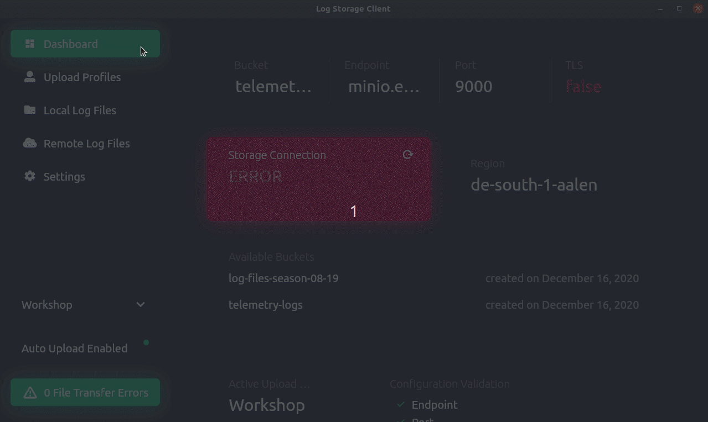

# Log Storage Client

The _Log Storage Client_ is a desktop app for uploading and downloading log files to an S3-based object storage. It's written in Dart using the Flutter framework and can connect to any storage system that implements the S3 protocol (e.g. [Amazon S3](https://aws.amazon.com/s3/) or [MinIO](https://min.io/)). It comes with an auto upload function and helps you to collect log files in a central place / storage.




## Features

* :tada: Can be connected to any storage system which implements the S3 protocol
* :page_facing_up: List files on local file system (offline) and on storage system (online)
* :floppy_disk: Upload and download (log) files
* :pager: Compatible with MinIO (on-premises deployment)
* :cloud: Compatible with Amazon S3 (SaaS / cloud / managed)
* :wrench: Settings view for configuring the connection details / credentials of the storage system (endpoint, port, TLS, etc.)
* :clipboard: Upload profiles which are attached to log files during upload as metadata
* :robot: Auto upload on creation of a trigger file
* :computer: Runs on Windows, OS X, and Linux
* :rainbow: Customizable accent color


## Installation

Download the latest release [from the release page](https://github.com/emotionrennteam/log-storage-client/releases). We provide builds for Windows (exe & msi), OS X (pkg), and Linux (deb, tar.gz).

If you want to try out this application but don't have access to an Amazon S3 bucket or a MinIO server, you can use these publicly available credentials which let you connect to the official MinIO demo server:

| Configuration key | Configuration value                                          |
| ----------------- | ------------------------------------------------------------ |
| Endpoint          | `play.minio.io`                                              |
| Port              | `443`                                                        |
| Region            | `us-east-1`                                                  |
| Bucket            | unknown (the list of available buckets changes every 24 hours, please login at [http://play.minio.io/minio/](http://play.minio.io/minio/)) |
| Access key        | `Q3AM3UQ867SPQQA43P2F`                                       |
| Secret key        | `zuf+tfteSlswRu7BJ86wekitnifILbZam1KYY3TG`                   |
| TLS               | enabled                                                      |


## Color Palette & Mock-ups

The directory `mockups/` contains mock-ups and the color palette used for this application. The design of this application was inspired by [Valery Pevnev (Podcast Dashboard)](https://dribbble.com/shots/9699028-Podcast-Dashboard) and [Kirill Kalita (Desktop app - Settings)](https://dribbble.com/shots/7090778-Desktop-app-Settings).


## Development

For getting started with Flutter, view the [online documentation](https://flutter.dev/docs) which offers tutorials, samples, guidance on mobile development, and a full API reference.


### Setup your development environment

There are several tutorials in the internet which explain how to setup Flutter for building desktop applications:

* https://codelabs.developers.google.com/codelabs/flutter-github-graphql-client#0
* https://medium.com/flutter-community/flutter-for-desktop-create-and-run-a-desktop-application-ebeb1604f1e0
* https://github.com/flutter/flutter/wiki/Desktop-shells

The following two sections provide simplified installation instructions:

#### Flutter

Prerequisites: Git, Visual Studio Code, Flutter (`dev` channel)

```bash
flutter channel dev
flutter upgrade

# Follow all instructions provided by Flutter Doctor (no need to install Android Studio though)
flutter doctor

flutter config --enable-windows-desktop # on Windows
flutter config --enable-macos-desktop   # on macOS
flutter config --enable-linux-desktop   # on Linux

git clone https://github.com/emotionrennteam/log-storage-client.git
cd log-storage-client/

flutter run
```

:warning: When using `flutter run` or when starting this application from Visual Studio Code, you won't be able to use the file picker integration. In order to test this functionality or work on it, you will have to install Go and *hover* and execute the application from the command line with `hover run`. The following paragraph describes how to install Go and *hover*. 

#### Go and hover

Desktop support in Flutter is still in technical preview / alpha. Therefore, some features are not available or don't work out of the box. The project [go-flutter](https://github.com/go-flutter-desktop/go-flutter) brings support for special features such as file pickers on Linux, MacOS, and Windows.

:warning:  The tool [hover](https://github.com/go-flutter-desktop/hover) is used as the build tool for this application. You will need to install Go and *hover* to compile this app and to be able to use all features. In specific, this application makes use of the Dart package [file_picker](https://pub.dev/packages/file_picker) which requires [Go](https://golang.org/doc/install) and [hover](https://github.com/go-flutter-desktop/hover). Please follow [these installation instructions](https://github.com/miguelpruivo/flutter_file_picker/wiki/Setup#--desktop-go-flutter) (install Go and *hover*). Short summary:

   1. [Install Go](https://golang.org/doc/install) and add the directory which contains the Go binary to your PATH environment variable. Also make sure to add the directory `$GOPATH/bin` to your PATH variable, too:

      ```bash
      export PATH=$PATH:/usr/local/go/bin
      export PATH=$PATH:$(go env GOPATH)/bin
      ```

   2. The build tool *hover* requires the installation of GCC:

         - Windows: please [install Cygwin](https://sourceware.org/cygwin/install.html) to use GCC on Windows. The gcc version of Cygwin somehow didn't work with *hover*. Instead, I had to use [tdm-gcc](https://jmeubank.github.io/tdm-gcc/) as denoted [here on StackOverflow](https://stackoverflow.com/questions/44605108/any-ideas-how-to-solve-this-cygwin-go-build-error).

         - Linux (requires some additional packages on top of GCC):

           ```bash
           sudo apt install gcc xorg-dev
           ```

   3. Install hover (Go will install hover to `$GOPATH/bin/hover`):
      ```bash
      GO111MODULE=on go get -u -a github.com/go-flutter-desktop/hover
      ```

   4. Run *hover* in Cygwin (on Windows) or in your favorite shell (on Linux):

      ```bash
      cd git clone https://github.com/emotionrennteam/log-storage-client.git
      cd log-storage-client/
      
      hover run
      ```


### Debugging

1. You can run this application either from Visual Studio Code or from the command line:

    1. From within Visual Studio Code:

        1. Open Visual Studio Code
        2. Open any `*.dart` file
        3. Hit F5 to run and debug the app

    2. From the command line:

        ```bash
        hover run
        ```

2. Start a local MinIO server (=on-premises S3 storage system):

    * Windows:
      
      1. Download MinIO Server from [https://min.io/download#/windows](https://min.io/download#/windows).
      
      2. Start the Minio server:
      
          ```powershell
          mkdir data
          
          ./minio.exe server data/
          ```
      
    * Linux:

        ```bash
        wget https://dl.min.io/server/minio/release/linux-amd64/minio
        
        chmod +x minio
        
        mkdir data
        MINIO_ACCESS_KEY=minioadmin MINIO_SECRET_KEY=minioadmin MINIO_REGION_NAME=de-south-1-aalen ./minio server ./data/
        ```

    * Docker:

        ```bash
        docker run \
            -p 9000:9000 \
            -e MINIO_ACCESS_KEY=minioadmin \
            -e MINIO_SECRET_KEY=minioadmin \
            -e MINIO_REGION_NAME=de-south-1-aalen \
            -v /tmp/data:/data minio/minio \
            server /data
        ```

3. Configure the _Log Storage Client_  so that it can connect to the MinIO server.

4. Hint: after starting the MinIO server, you can access the web UI of MinIO on http://127.0.0.1:9000. The default credentials are:

    * User: `minioadmin`
    * Password: `minioadmin`


### Building a release

For building a release of this app, Docker, Go, and hover must be installed.

```bash
# Linux executable
hover build linux --docker
# Linux deb
hover build linux-deb --docker

# OS X pkg
hover build darwin-pkg --docker

# Windows exe
hover build windows --docker
# Windows MSI
hover build windows-msi --docker
```

The resulting binaries are located in `go/build/outputs/`. You can also build without the option `--docker`. In this case, you can only build the app for your current OS only but you won't need Docker.


## FAQ

**Where does this application store its configuration?**

The configuration of this application (connection details to S3 storage, etc.) is stored in a file named `shared_preferences.json`. Depending on your OS, this configuration file might be stored in one of the following locations:

* Linux:
    * `~/.local/share/log_storage_client/shared_preferences.json`
* Windows:
    * `C:\Users\$USER\AppData\Roaming\log_storage_client\shared_preferences.json`
    * `C:\Users\$USER\AppData\Roaming\de.aalen.university.emotion.logstorageclient\emotion\shared_preferences.json`
* OS X: ?

